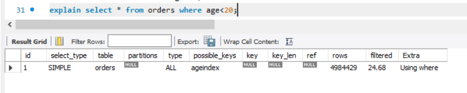
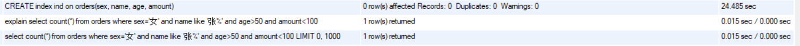

# 0

    create database practice;

# 1

    use practice;
    create table students(
                           id int primary key auto_increment,
                           student_id int,
                           course_id int,
                           score int
    );
# 2

    insert into students (student_id, course_id, score) values (1, 1, 99);
# 3

    update students set score = 100 where student_id = 1 and course_id = 1;
# 4

    delete from students where student_id=1 and course_id=1;

# 5

    select max(score) from score where student_id = 1;

# 6

    select min(score) from score where student_id = 1;

# 7

    select course_id, max(score) from score group by course_id;

# 8

    select course_id, max(score) from score group by course_id having count(student_id)>1 ;

# 9

    select course_id, avg(score) from score group by course_id;

# 10

    select course_id, score from score where student_id=1 order by score desc;

# 11

    select a.name, b.score from student a, score b where a.id=1 and b.student_id=1 and b.course_id=1;

# 索引练习 

>给出下面每个需求的SQL语句,然后思考能否使用索引进行查询优化,若能,则给出建立索引的方式和理由,并比较建立索引前后查询时间和查询计划(注意,这里是两方面!!)的变化;若不能,说明原因。提示:使用explain进行查询计划的查看,需给出截图展示,可酌情给出解释,但不要过多赘述。
## 问题1:在 orders 表中找出购买人年龄小于20岁的order列表。

### 不使用索引时 

    select * from orders where age<20; 
    explain select * from orders where age<20;

   
   
   
   
### 使用索引时

    CREATE INDEX ageindex on orders(age);
    SELECT * FROM orders WHERE age<20;
    explain select * from orders where age<20;    
   
   
 > 发现创建索引时间较长，但是最后却没有使用索引，而且花的时间也长一些。
 >或许是因为数据量小，自动没有使用索引？
 >结论：这个不适合使用索引。。

## 问题2:在 orders 表中找出所有姓王的人的order列表。 
### 不使用索引时 

    select * from orders where name LIKE '王%'; 
    EXPLAIN SELECT * FROM orders WHERE name LIKE '王%';
    
   
   
   
   
### 使用索引时

    create index nameindex on orders(name);
    select * from orders where name LIKE '王%';
    EXPLAIN SELECT * FROM orders WHERE name LIKE '王%';    
    
   
   
   
   
 > 使用索引之后，查询的速度变快
 >结论：这个适合使用索引！

## 问题3:统计 orders 表中所有男性的人的数量。

### 不使用索引时 

    select * from orders where sex='男';
    explain select * from orders where sex='男';
   
   
   

### 使用索引时

    CREATE index sexindex on orders(sex);
    select * from orders where sex='男';
    explain select * from orders where sex='男';    
    
   
   
   
   
 > 使用索引之后，查询的速度与没有使用索引差不多，但是创建索引花了较多时间，而且如果对表做出修改，对应索引文件还要再修改，麻烦且浪费资源。
 >结论：这个不适合使用索引。。
## 问题4:在 orders 表中计算女性,姓张,年龄大于50,且消费小于100的人数。 
### 不使用索引时 

    select count(*) from orders where sex='女' and name like '张%' and age>50 and amount<100;
    explain select count(*) from orders where sex='女' and name like '张%' and age>50 and amount<100;
    
   
   
   
  

### 使用索引时

    CREATE index ind on orders(sex, name, age, amount);
    select count(*) from orders where sex='女' and name like '张%' and age>50 and amount<100;
    explain select count(*) from orders where sex='女' and name like '张%' and age>50 and amount<100; 
    
   
   
   
   
 > 使用索引之后，查询的速度确实快了许多。但是建立这个多列索引也花了不少时间。
 >结论：应该适合吧，（如果不用经常改这个表）
## 问题5:统计 orders 表中姓名为三个字的人数。 
### 不使用索引时 

    select count(*) from practice.orders where name like '___';
    explain select count(*) from practice.orders where name like '___';
    
   
   
   
   
### 使用索引时

    create INDEX nameindex on orders(name);
    select count(*) from practice.orders where name like '___';
    explain select count(*) from practice.orders where name like '___';    
    
   
   
   
   
 > 使用索引之后，查询的速度更快了。
 >有两个奇怪的地方
 1. 我在sqlbench里面看orders有1000条数据，但是使用count(*)查，却有5000000条
 2. 使用索引之后explain一下，发现possible_keys是null，但是又确实使用了那个索引。。
 >以后希望可以知道答案。
 >结论：这个适合使用索引！
## 问题6:在 products 表中查找库存大于150的product列表。
### 不使用索引时 

    select * from products WHERE nums>150;
    explain select * from products WHERE nums>150;
    
   
   
   
   
### 使用索引时

    alter table products add index numsindex(nums);
    select * from products WHERE nums>150;
    explain select * from products WHERE nums>150;   
    
   
   
   
   
 > 使用索引之后，查询的速度与没有使用索引差不多，但是创建索引花了较多时间，而且如果对表做出修改，对应索引文件还要再修改，麻烦且浪费资源。
 >结论：这个不适合使用索引。。

