mysql的安装真是够呛嘤嘤嘤。

# 0-4
> 创建数据库：create database database_name

> 选择数据库：use database_name

> 显示所有数据库：show databases

> 创建数据表：create table table_name (key_name key_type, key_name key_type, ...)

> 显示所有数据表：show tables

> 查询数据：select key_name, key_name from table_name [where key_name=value] [limit N] [offset M]

> 插入数据：insert into table_name (key_name, key_name) values (value, value)

> 更新数据：update table_name set key_name=value [where]

> 删除数据：delete from table_name [where]

> 删除数据表：drop table table_name

> 查看数据表结构：desc table_name

# 5-
> 5.查找学生ID为1的学生最高成绩（使用max函数）
> 
> select max(score) from score where student_id=1

> 6.查找学生ID为1的学生最低成绩（使用min函数）
> 
> select min(score) from score where student_id=1

> 7.找出各门课程的最高成绩（使用max/groupBy函数）
> 
> select course_id, max(score) from score group by course_id

> 8.找出各门课程的最高成绩,如果这门课程参与人数少于2人，则不参与统计（使用max/groupBy/having/count函数）
> 
> select course_id, max(score) from score group by course_id having count(student_id)>1

我参考的资料，真的好理解啊：[group by和聚合函数（很好理解版）](https://blog.csdn.net/intmainhhh/article/details/80777582)

> 9.找出各门课程的平均成绩（使用avg/groupBy函数）
> 
> select course_id, avg(score) from score group by course_id

> 10.查找学生ID为1学生的所有成绩，成绩按从高往低显示
> 
> select course_id, score from score where student_id=1 order by score desc

> 11.查找学生ID为1并且课程ID为1的姓名和成绩（使用score和student两张表联合查询，观察两个表结构）
> 
> select a.name, b.score from student a, score b where a.id=1 and b.student_id=1 and b.course_id=1

# 索引
## 问题1:在 orders 表中找出购买人年龄小于20岁的order列表。
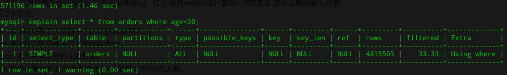
若以age为索引，则默认情况下，mysql预估出不使用age索引搜索比使用age索引搜索慢，所以不使用索引搜索。当强制使用age索引时，速度反而变慢了。
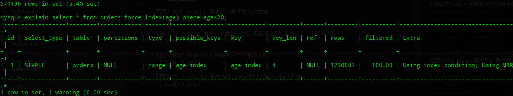
*<b style="color: red;">这里我有点疑惑，查找网上的资料，对于where字段中有大小判断的查询，是建议使用索引的，但是不知道为什么我使用索引以后反而速度变慢了</b>*

---

## 问题2:在 orders 表中找出所有姓王的人的order列表。
我一开始用的是left函数，所以即使添加索引也是没办法使用索引的。
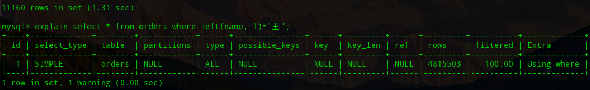
甚至连possible_keys都是没有的。
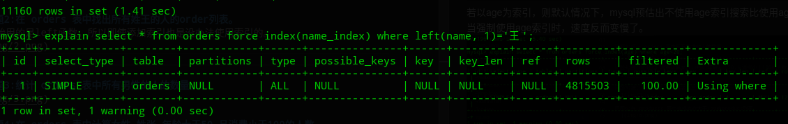

---------分割线---------

之后使用了like，这是忽略索引的情况。
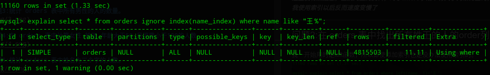
使用索引后
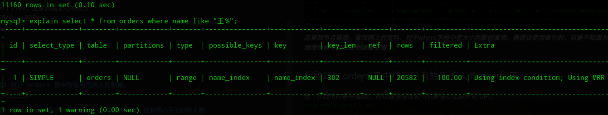
查询时间快了很多，查询计划中也显示用了索引，查询的行数显著变小。

度娘了以后知道了：like中不以通配符为开头的查询是可以使用索引来加速的。

---

## 问题3:统计 orders 表中所有男性的人的数量。
在不对sex索引的情况下
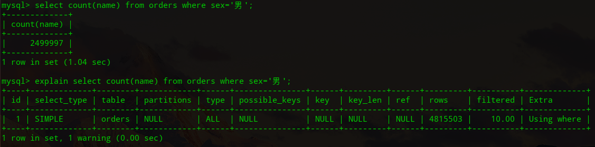
在对sex索引的情况下
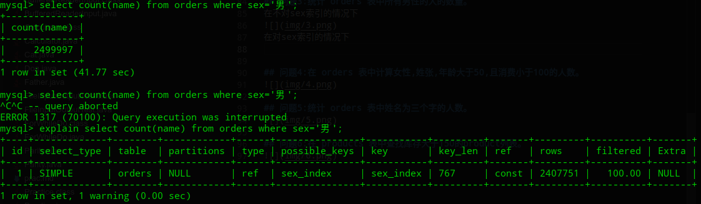
枯了。对于值域集合小的列，千万别用索引。

---

## 问题4:在 orders 表中计算女性,姓张,年龄大于50,且消费小于100的人数。
不使用索引，和问题一差不多。
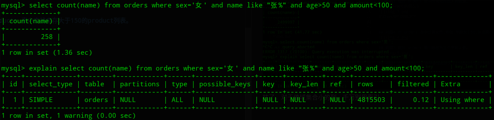

---

## 问题5:统计 orders 表中姓名为三个字的人数。
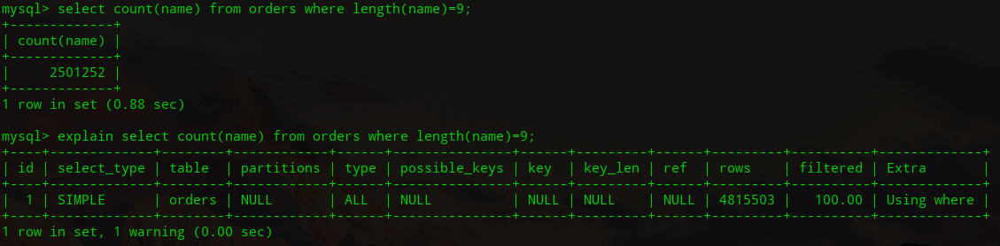
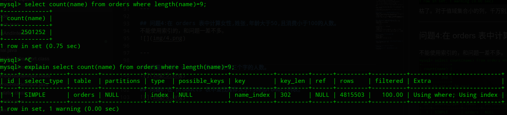
使用name索引后，速度快了一些，检索的行数没变，变快的原因我猜大概是名字长度确定可以在索引的数据结构里更快定位吧。

---

## 问题6:在 products 表中查找库存大于150的product列表。
不使用索引，和问题一差不多。

并且由于数据表中记录太少，使用索引可能反而拖慢速度。
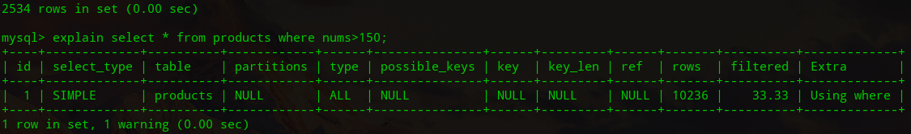